# Homelessness, Employment, and Poverty in Colorado

## Does the Homeless Students and PIT data correlate?

- [Point in Time (PIT) Data](https://www.hudexchange.info/resource/3031/pit-and-hic-data-since-2007/)
- [Homeless Students](https://www.cde.state.co.us/studentsupport/homeless_data)

### Overall Homeless in Colorado

First, we will look at the overall homeless population in Colorado from 2011 to 2021 from our PIT (Point in Time) Homeless data set. The data shows that the overall homeless population has been decreasing over the years. The line chart shows a sharp decrease from 2012 to 2013, followed by a steady increase in the homeless population from 2013 to 2017, with a slight decrease in 2018. The homeless population then increased again from 2019 to 2020, and end with another rapid decrease from 2020 to 2021.

|                                         Bar Chart                                         |                                         Line Chart                                          |
| :---------------------------------------------------------------------------------------: | :-----------------------------------------------------------------------------------------: |
| 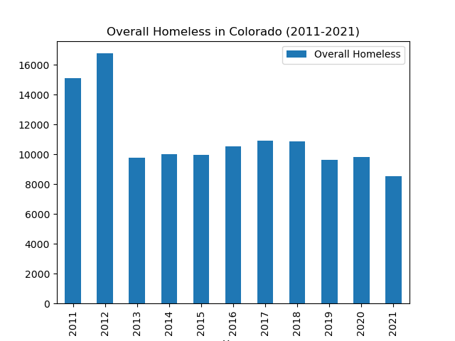 |  |

### Homeless Students

Next we will need to look at the data for homeless students in Colorado.

#### Average Homeless Students in Colorado

We will now look at the average homeless students across all of Colorado from 2011 to 2021 from our Homeless Students data source. The data shows that the average homeless students have also been decreasing over the years. The line chart shows an increase in the average homeless students from 2011 to it's peak in 2014. From 2014 to 2020 we see a downard trend with the most notible drop from 2019 to 2020, but then we see a slight increase in 2021.

|                                                  Bar Chart                                                   |                                                   Line Chart                                                   |
| :----------------------------------------------------------------------------------------------------------: | :------------------------------------------------------------------------------------------------------------: |
|  |  |

#### Average Homeless Students in Rural Counties

Looking at the same data across rural counties we can see that homeless students have been increasing steadily from 2011 to 2021. The line chart shows a sharp drop from 2016 to 2017 followed by a rapid rise to 2018. Since then the average homeless students in rural counties have been decreasing. This trend does not seem to conform to the trends of Colorado as a whole except for a general rise from 2011 to 2014 but it continues to rise as Colorado as a whole falls the subsequent two years until 2016. This could be due to the fact that the rural counties have a smaller population and the data is more volatile.

|                                                        Bar Chart                                                         |                                                         Line Chart                                                         |
| :----------------------------------------------------------------------------------------------------------------------: | :------------------------------------------------------------------------------------------------------------------------: |
|  | 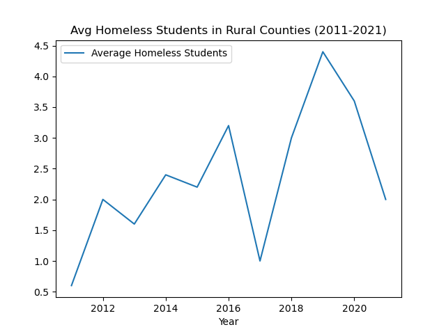 |

#### Average Homeless Students in Urban Counties

The overall trends of homeless students in urban counties seems to most strongly correlate with Colorado as a whole. This is somewhat expected as the urban counties make up the majority of the population of Colorado. The line chart shows a sharp drop from 2016 to 2017 followed by a rapid rise to 2018. Since then the average homeless students in urban counties have been decreasing. This trend does not seem to conform to the trends of Colorado as a whole except for a general rise from 2011 to 2014 but it continues to rise as Colorado as a whole falls the subsequent two years until 2016.

|                                                        Bar Chart                                                         |                                                         Line Chart                                                         |
| :----------------------------------------------------------------------------------------------------------------------: | :------------------------------------------------------------------------------------------------------------------------: |
| 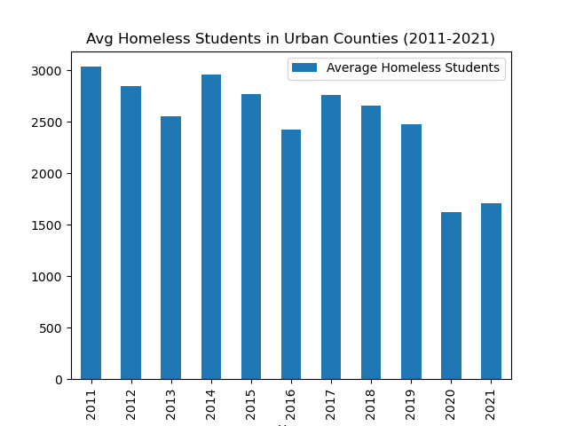 | 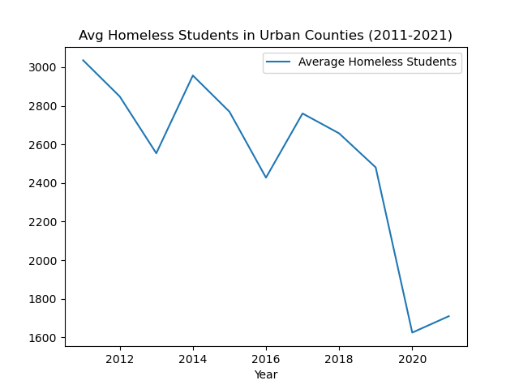 |

### Overall Homeless vs. Average Homeless Students

Knowing the trends of our PIT homeless data and our Average Homeless Student data, we can now start to compare the two and see if there is any correlation. Comparing between Colorado overall and the top 5 most and least populated counties, we can see that the overall homeless population and the average homeless students in Colorado do not share the same trends. While overall homeless population has been decreasing over the years, the average homeless students have been decreasing too but they seem to be unrelated. This could be due to the fact that the overall homeless population includes all homeless individuals, while the average homeless students only includes homeless students.

|                                                                      Bar Chart                                                                      |                                                                      Line Chart                                                                       |
| :-------------------------------------------------------------------------------------------------------------------------------------------------: | :---------------------------------------------------------------------------------------------------------------------------------------------------: |
|  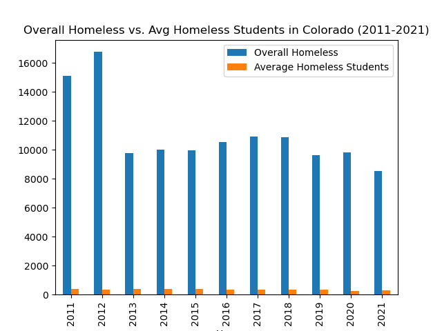   |  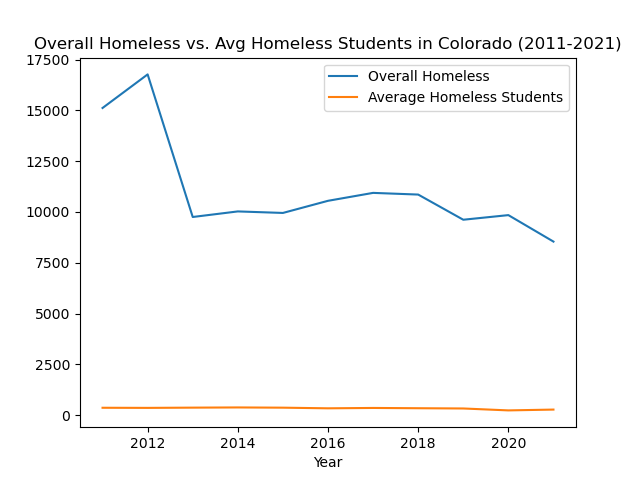   |
|  |  |
|  | 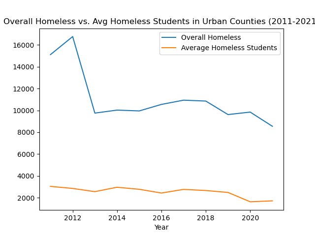 |

### Does the Homeless Students and PIT data correlate?: Conclusion

So to answer our question of "Does the Homeless Students and PIT data correlate?" we can say that the overall homeless population and the average homeless students in Colorado do not correlate. The overall homeless population has been decreasing over the years, while the average homeless students have been decreasing too but they seem to be unrelated. This could be due to the fact that the overall homeless population includes all homeless individuals, while the average homeless students only includes homeless students.

## Is there a relationship between poverty and employment?

- [U.S. Census Bureau](https://www.census.gov/)

### Poverty Count in Colorado

In order to compare poverty to employment, we should first look at poverty counts in Colorado as a whole, then we will compare that to urban and rural county trends. We can see that overall, Colorado saw a steady increase in povety from 2011 to 2014 but since then it has been devreasing. We can see this trend mimiced in our urban counties but in our rural counties we can almost see a seasonal trend every few yeard where the poverty count will rise and fall; though overall, rural counties have also trended downward.

|                                              Bar Chart                                               |                                               Line Chart                                               |
| :--------------------------------------------------------------------------------------------------: | :----------------------------------------------------------------------------------------------------: |
|              |              |
| 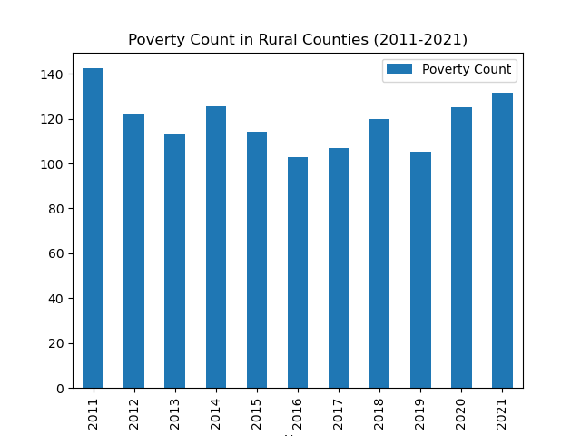 |  |
| 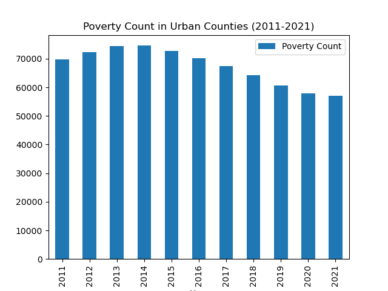 |  |

### Employment in Colorado

Next we will look into employment trends in Colorado. Similarly to poverty count, we will also look at Colorado as a whole, then compare that to urban and rural county trends. We can see that overall, Colorado saw a steady increase in employment from 2011 to 2021. It appears that unemployment has followed a similar trend, though we see what looks to be a plateau from 2020 to 2021. As with poverty, we see the rural counties not matching our overall trends or our urban county trends. We see that rural counties have seen a steady decrease in employment from 2011 to 2021. Urban counties have seen a steady increase in employment from 2011 to 2021.

|                                        Bar Chart                                         |                                         Line Chart                                         |
| :--------------------------------------------------------------------------------------: | :----------------------------------------------------------------------------------------: |
|    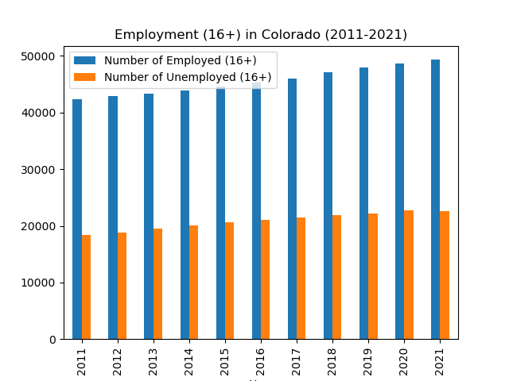    |        |
|  | 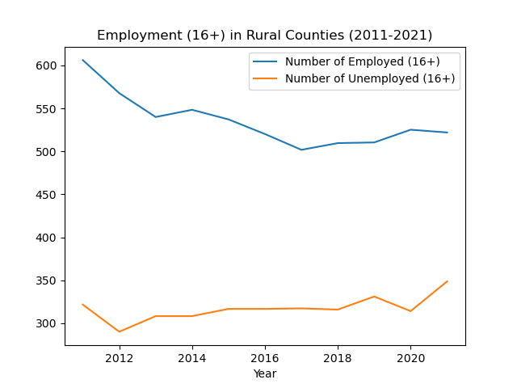 |
|  | 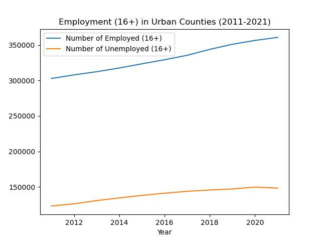 |

### Poverty Count vs. Employment Ages 16+ in Colorado

Now that we have seen the trends of poverty and employment in Colorado, we can now compare the two to see if there is any correlation. We can see that the poverty count and employment trends in Colorado as a whole do seem to correlate. We seem to see a reverse correlation between the two, as poverty count decreases, employment increases. This trend is not as clear in our rural counties, but it is very clear in our urban counties.

|                                                                 Bar Chart                                                                  |                                                                  Line Chart                                                                  |
| :----------------------------------------------------------------------------------------------------------------------------------------: | :------------------------------------------------------------------------------------------------------------------------------------------: |
|              |       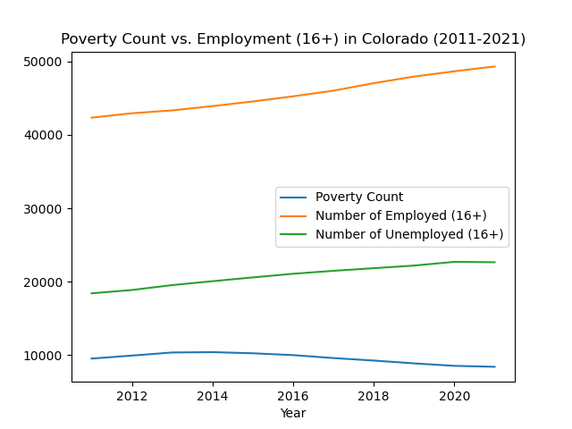       |
| 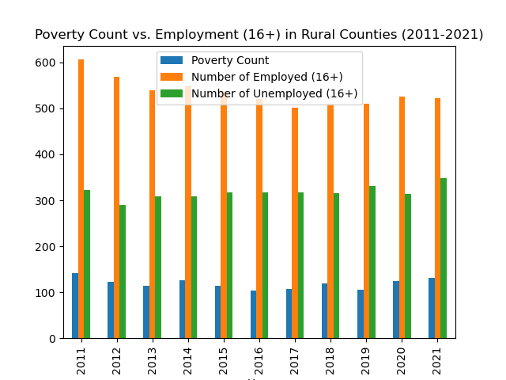 |  |
|  |  |

### Is there a relationship between poverty and employment?: Conclusion

To answer our question of "Is there a relationship between poverty and employment?" we can say that there is a relationship between poverty and employment in Colorado. We seem to see an inverse correlation between the two, as poverty count decreases, employment increases. This trend is not as clear in our rural counties, but it is very clear in our urban counties. There also seems to be no noticable effect on employment or poverty count from the early COVID-19 pandemic window that we are able to see.
