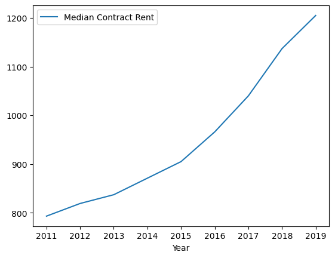
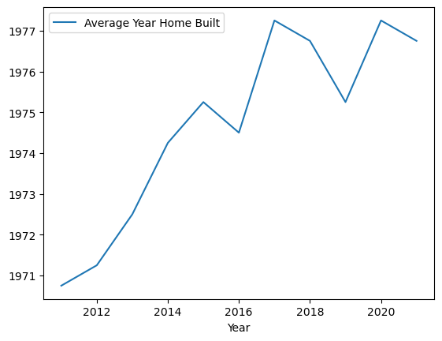
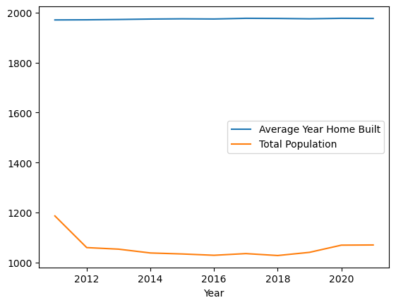
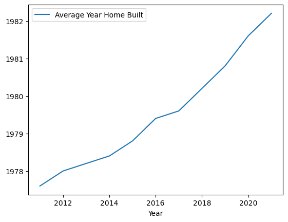
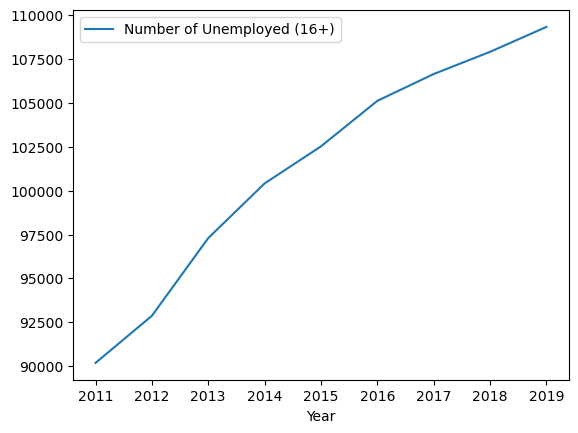
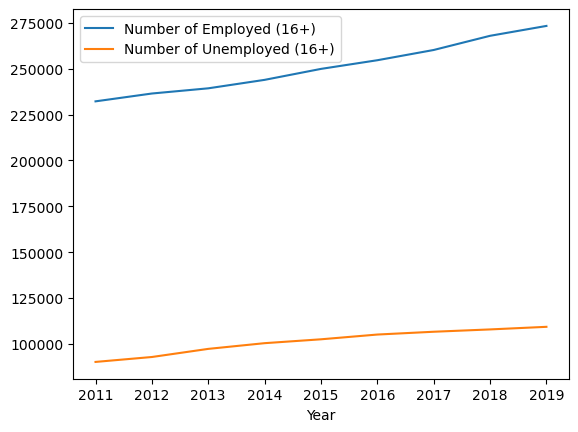
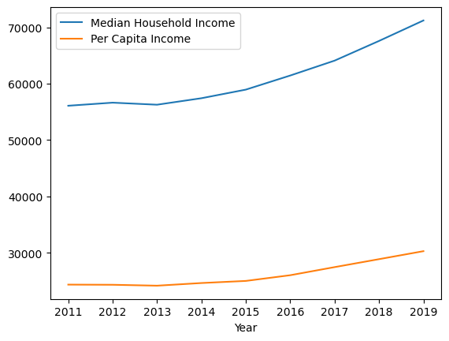

# Poverty in Colorado

A study on homelessness in Denver, Colorado.

## Project Purpose
The past two or three decades have witnessed a startling rise in the number of Americans living in poverty. This complex issue has a multitude of contributing factors, but our team will zero in on five key areas to explore potential correlations: Income, poverty, employment, housing, and homelessness/hunger. While there may be a surface-level inclination to believe a strong "yes" exists between poverty and each of these factors, a more nuanced approach is required.  Before jumping to conclusions or perpetuating stereotypes, we must meticulously analyze the data and translate it into clear visualizations. It's crucial to remember that correlation does not imply causation. Just because two factors appear to be linked doesn't necessarily mean one causes the other. Through rigorous analysis and objective data exploration, we hope to paint a clearer picture of the multifaceted relationship between poverty and these specific areas of our society.

## Questions to be addressed
Our overarching question is "How did we get here"?

Poverty

Housing:
* Is income keeping pace with the average price of rent?
* Is there a correlation between the cost of rent, the value of home ownership, and the average monthly housing expense with a mortgage?
* Is there a correlation between the average year of homes built and the population of the five largest counties (by population) and the five smallest counties (by population)?

Employment:
* Is there a correlation between employed people over the age of 16 and unemployed people over the age of 16?
* Is there a correlation between median household income and per capita income?

Income

Homelessness

## Overview of data collection, cleanup and exploration process

## Approach taken to achieve goals

## Observation 1

## Housing Observation:
Is income keeping pace with the average price of rent?

The analysis of income trends compared to the average price of rent involved plotting data on median household income, the average cost of rent and utilities, and all data combined. This data was sourced from the U.S. Census, providing a comprehensive view of income and housing cost dynamics over time. Through visualizations and numerical analysis, we aimed to determine whether income growth is in line with the rise in average rent and utilities.

The findings from the analysis provide insights into the relationship between income and housing costs. By examining the plotted data, we can discern whether income levels are keeping pace with the increasing average price of rent and utilities. A consistent or increasing trend in income aligned with a similar pattern in rent and utilities would suggest that income is indeed keeping pace with housing costs. On the other hand, if the trend in housing costs outpaces income growth, it indicates potential challenges in housing affordability.

## Housing Observation: 
Is there a correlation between the cost of rent, the value of home ownership, and the average monthly housing expense with a mortgage?

To assess the correlation between the cost of rent, the value of home ownership, and the average monthly housing expense with a mortgage, data was gathered from the U.S. Census focusing on variables such as "Average Monthly Housing Expense with Mortgage," "Median Contract Rent," and "Average Value of Owner-occupied Home." The data was then processed using grouping and averaging the relevant variables by year. This approach allowed for a comprehensive analysis of trends over time and facilitated the examination of potential correlations between these housing-related metrics.

The analysis revealed interesting insights into the relationships between housing costs, home values, and mortgage expenses. There was a strong positive correlation between the cost of rent and average monthly housing expenses with a mortgage, indicating that as rental prices increase, so do mortgage expenses for homeowners. Additionally, a moderate positive correlation was observed between home values and average monthly housing expenses with a mortgage, suggesting that higher home values are associated with higher mortgage payments. These findings emphasize the interconnectedness of housing and homeownership expenses.

## Housing Observation:
Is there a correlation between the average year of homes built and the population of the five largest counties (by population) and the five smallest counties (by population)?

The analysis aimed to determine if there is a correlation between the average year of homes built and the population of the five largest counties and the five smallest counties, both categorized by population size. The data for this analysis was gathered from the U.S. Census, focusing on variables such as "Average Year Home Built," "Total Population," "County," and "Year." We were able to extract and group the data, separating it into urban and rural areas based on the counties' population sizes.

Upon analyzing the data, distinct trends were observed between the average year of homes built and the population of counties. In the five largest counties, there appeared to be a correlation between population size and newer home construction, indicated by a trend of decreasing average year of home construction as population size increased. Conversely, in the five smallest counties, there was a different trend, suggesting that smaller populations were associated with older homes on average. These findings highlight potential patterns in housing development and population distribution, which can be valuable for urban planning, real estate, and demographic studies.

## Employment Observation:
Is there a correlation between employed people over the age of 16 and unemployed people over the age of 16?

The analysis delved into determining if there exists a correlation between employed individuals over the age of 16 and unemployed individuals over the age of 16. To conduct this analysis, data was gathered from the U.S. Census, specifically focusing the variables "Number of Employed (16+)" and "Number of Unemployed (16+)" over a specified time period. The data was then processed by grouping and averaging the number of employed and unemployed individuals by year, offering a comprehensive view of employment trends over time.

Upon analyzing the data, it was observed that there is indeed a correlation between employed individuals over the age of 16 and unemployed individuals over the age of 16. The visualizations of the data showed an inverse relationship between these two variables, where periods of higher employment rates corresponded to lower unemployment rates, and vice versa. This correlation underscores the dynamic nature of the labor market, where changes in employment opportunities directly impact the level of unemployment within a population. Such insights are crucial for policymakers, economists, and workforce development initiatives in understanding and addressing labor market trends and dynamics.

## Employment Observation:
Is there a correlation between median household income and per capita income?

The analysis aimed to investigate whether there exists a correlation between median household income and per capita income. To conduct this analysis, data was gathered from the U.S. Census, focusing on the "Median Household Income" and "Per Capita Income" over a specified time period. The data was then processed by grouping and averaging the median household income and per capita income by year, allowing for a comparative analysis of income trends.

Upon analyzing the data, it was observed that there is indeed a correlation between median household income and per capita income. The visualizations of the data depicted a positive relationship between these two variables, where periods of higher median household income were associated with higher per capita income, and vice versa. This correlation underscores the interplay between household income levels and individual income within a population. It suggests that as household incomes rise, there is a tendency for individual incomes to also increase, reflecting overall economic prosperity and well-being. These findings are essential for understanding income distribution patterns and socioeconomic trends, providing valuable insights for policymakers, economists, and social researchers in addressing income inequality and improving economic opportunities for individuals and households.

## Observation 5

## Summary of findings

## Problems Encountered

Poverty

Housing:

* An issue identified in the U.S. Census data pertained to the year 2020. Initially attributing the negative integer to data errors, it was later revealed that the anomaly stemmed from the pandemic's impact on data collection during that period.

Income

Homelessness

## Conclusion and Future Considerations
## Authors

Michael Bolens, Beau Dunavant IV, Robb Stenman

## Data

The data used in this project are sourced from

- [U.S. Census Bureau](https://www.census.gov/)
- TODO: Add more data sources
