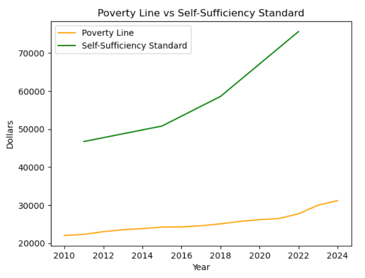
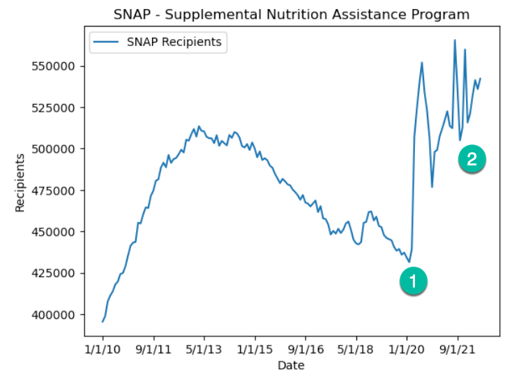

# Poverty in Colorado

A study on homelessness in Denver, Colorado.

## Project Purpose
The past two or three decades have witnessed a startling rise in the number of Americans living in poverty. This complex issue has a multitude of contributing factors, but our team will zero in on five key areas to explore potential correlations: Income, poverty, employment, housing, and homelessness/hunger. While there may be a surface-level inclination to believe a strong "yes" exists between poverty and each of these factors, a more nuanced approach is required.  Before jumping to conclusions or perpetuating stereotypes, we must meticulously analyze the data and translate it into clear visualizations. It's crucial to remember that correlation does not imply causation. Just because two factors appear to be linked doesn't necessarily mean one causes the other. Through rigorous analysis and objective data exploration, we hope to paint a clearer picture of the multifaceted relationship between poverty and these specific areas of our society.

## Questions to be addressed
* Poverty...
* Housing...
* Employment...
* Income...
* Homelessness...

## Overview of data collection, cleanup and exploration process

## Approach taken to achieve goals

## Observation 1

## Observation 2

## Observation 3

## Observation 4

## Observation 5

## Summary of findings

## Problems Encountered

## Conclusion and Future Considerations
## Authors

Michael Bolens, Beau Dunavant IV, Robb Stenman

## Data

----------------------------

### Is the supply of available beds for the homeless population keeping up with the number of homeless individuals?

One of the most visible signs of poverty is homelessness. We looked at the Point in Time Count (PIT), which is an actual count of homeless people on a single night each January. We compared this to the Housing Inventory Count (HIC), which is a count of beds provided through agencies and non-profits to the homeless. The Department of Housing and Urban Development is responsible for creating the definitions of who qualifies and compiling the data.

The data has two anomalies. First, in Colorado, the methodology for how to count homeless changed between 2012 and 2013. This caused the reported number of homeless to drop from 16,768 in 2012 to 9,754 in 2013. This was not an actual decrease in the number of homeless, just a change in how the count was done. The second anomaly was in 2021. The PIT count took place in January, and this was at the height of the Covid pandemic. The data suggests that there were more beds available than homeless people. However, the reality is that the PIT Count underrepresented the homeless population.

A third possible anomaly is the 2023 PIT Count. At this point, it is not clear what caused the number to increase from 10,397 to 14,439. It could be a one-year exception, or it could be the new normal.

When analyzing the overall data set, a concerning trend emerges there are not enough beds available to accommodate the current homeless population. The fluctuations in both the PIT Count and HIC data make it difficult to identify a clear trend, but the underlying issue remains: the need for housing and support services for the homeless population exceeds the current capacity.

 

### How does Colorado’s Self-Sufficiency Standard compare with the Federal Poverty Level?

The Self-Sufficiency Standard (SSS) and the Federal Poverty Level (FPL) are two different approaches to measuring the cost of living and determining poverty thresholds.

The SSS was developed by the Center for Women’s Welfare at the University of Washington. It considers a variety of cost factors, such as housing, childcare, healthcare, transportation, food, and other necessities to determine a “living wage” for different geographic areas and family sizes.  This provides a much better picture of what is necessary to meet people’s basic needs based on where they live.

The FPL is determined by the US Census Bureau and is used by several federal agencies to determine eligibility for benefits. The FPL is an amount that is the same across the lower 48 states. It does account for family size, but not for regional cost differences. The SSS is calculated every 4 years while the FPL is calculated annually.

We were curious how the SSS compared to the FPL in Colorado. We looked at the SSS data for 4 people (2 adults and 2 school-age) vs the FPL for 4 people. Across the data sets, the SSS amount was over twice as much as the FPL for Colorado. More concerning is that the gap between the SSS and FPL is widening over time. This means that people living in Colorado will be disadvantaged when receiving government aid based on a formula that only looks at FPL.

 

### Has the number of SNAP recipients increased steadily over time?

The Supplemental Nutrition Assistance Program (SNAP), formerly known as Food Stamps, is a federal program that provides low-income households with Electronic Benefit Cards (EBT) to purchase food. We thought data on the monthly SNAP recipients would provide a good indicator of the number of people struggling with food insecurity.

From 2010 to 2013, the number of SNAP recipients in Colorado was increasing, potentially as a consequence of the 2008 financial crisis. However, from 2013 to 2020 the number of SNAP recipients in Colorado fell significantly. From a high of 513,483 recipients in March of 2013 to 431,397 recipients in February 2020.

Then Covid happened. The data becomes more ambiguous after this point and continues to be difficult to understand through June 2022, when our data set ends. There are 3 spikes in the number of recipients: July 2020, August 2021, and December 2121, where the number of monthly recipients exceeded 550,000. It is unclear to us what caused these spikes.

Given the number of people who appear to be struggling with food insecurity, we thought the time-series data would have shown a steady increase in SNAP recipients. However, the opposite was true. SNAP recipients were decreasing until Covid. It is unclear at this point if the number of recipients will remain elevated or if it will return to pre-Covid levels.

 

### Do the income levels and cost of living differ between large, populous counties and smaller, less populated counties?

We started by looking at per capita income for the five largest and five smallest counties in Colorado. In 2012, the per capita incomes were comparable. However, from 2011 to 2017 incomes in the smallest counties were trending downwards, while the largest counties saw their per capita income increasing steadily. In 2017, the small counties’ income started rising, but not at the same rate as large counties. In 2021, the average per capita income in the largest counties was $43,218 while the smallest counties’ average was $33,648, a difference of $9,750.

We also looked at per capita income compared against the Self-Sufficiency Standard (SSS). In the five largest counties, the SSS is increasing relative to per capita income. However, in the five smallest counties, the SSS appears to be closing the gap with per capita income. This could be a concerning trend if it continues.

 
 
 

## Data Challenges

There were four major challenges we faced with the date:

1.     Covid - The biggest challenge in analyzing the data was the presence of anomalies caused by the Covid pandemic. The PIT Count data for 2021 showed more beds available than homeless, which we know is not accurate. The SNAP data had unexplained peaks during Covid. This Covid era data will cause data analysis issues for years to come.
2.     Understanding Data Collection Methodologies – It took time to research the methodology for gathering each data set. There are different definitions for each variable, and it is important to understand the method and purpose of data collection.
3.     Changes to Methodologies – When a major change is made to the method or definition it can significantly affect the data. If one did not know there was a change in method, one could easily draw the wrong conclusion.
4.     Granularity or Amount of Detail – It was surprising how much detail was included in some data sets. One source we considered had over 400 fields of data to categorize types of housing.

## Summary/Conclusion

We saw two different stories in our data sets. Before 2020, most indicators were moving in a positive direction. Incomes were rising, employment was increasing, rent was stable, and SNAP recipients were decreasing. However, the Covid pandemic changed that outlook. We don’t have up-to-date data for all areas, but where the data is available, it shows that the poorer populations need more help.

It will be interesting in the coming years to revisit this data to see if the challenges caused by Covid are permanent or only temporary.

## Future Considerations
There is an abundance of data sets dealing with poverty, income, housing, homelessness, and employment. We would recommend limiting the data sets to one type of data. This would allow for a deeper investigation into the data. We would also recommend focusing on one or two counties. We used different data sets with overlapping date ranges. This caused some comparisons to be lacking as we did not have complete data for all years. 

It would be beneficial to look at both private sources of data along with government-provided data.

## Help is Available
One encouraging thing we learned from this exercise is that help is available. Several organizations are dedicated to helping the poor. Here are some representative organizations and government departments.

Hunger Free Colorado
2 1 1 Colorado
Colorado Coalition for the Homeless
Colorado Department of Human Services
Colorado Department of Local Affairs

## Data Sources
[Center for Women’s Welfare at the University of Washington](https://selfsufficiencystandard.org/colorado/)

[Colorado Department of Education - Homeless Education Data](https://www.cde.state.co.us/studentsupport/homeless_data)

[Federal Reserve Economic Data (FRED)](https://fred.stlouisfed.org/series/BRCO08M647NCEN)
Economic Research - Federal Reserve Bank of St. Louis

[HUD Exchange](https://www.hudexchange.info/resource/3031/pit-and-hic-data-since-2007/)

[US Census Data](https://www.census.gov/en.html)

## Additional Research Sources

[Colorado Coalition for the Homeless](https://www.coloradocoalition.org/sites/default/files/2024-01/2023%20StateOfHomelessness_CCH_F_0.pdf)

[Colorado Department of Human Services](https://cdhs.colorado.gov/snap)

[Hunger Free Colorado](https://hungerfreecolorado.org/)

[Urban Institute](https://www.urban.org/sites/default/files/publication/25626/412613-SNAP-s-Role-in-the-Great-Recession-and-Beyond.PDF)

[9News](https://www.9news.com/article/news/colorados-homeless-population-is-increasing-so-why-does-this-hud-report-say-otherwise/73-497483910)

